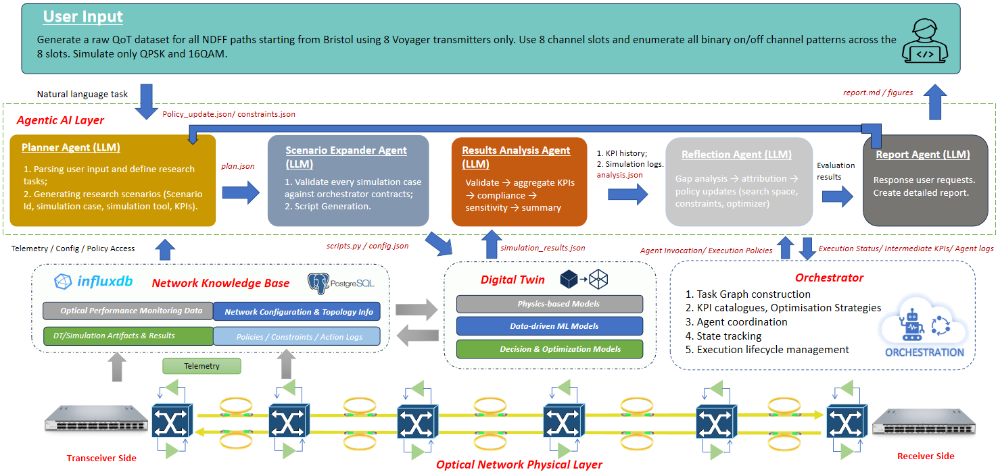
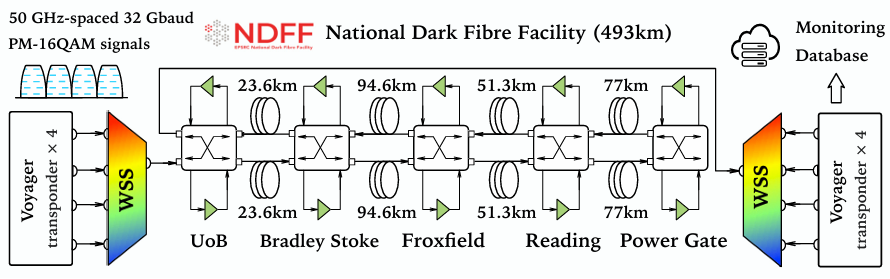

# LLM-Driven Multi-Agent Optical Digital Twin for Automated Data Generation

The proposed LLM-driven multi-agent optical DT framework translates natural-language user requests into executable physical-layer studies through a layered architecture comprising an agentic AI layer, an orchestrator, a network knowledge base, a digital twin, and the optical network physical layer. It bridges unstructured user intents and reproducible optical-network experimentation by automatically deriving study objectives, simulation constraints, scenario definitions, and reporting targets. The optical network physical layer provides real network topology, device configuration, and monitoring data through telemetry protocols such as gRPC, NETCONFIG and REST APIs. These data are stored in the knowledge base using InfluxDB and PostgreSQL to support both agent reasoning and DT execution. It also stores simulation artifacts, historical results, policies, constraints, and action logs. Specifically, InfluxDB, a time-series database, is primarily used to store time-stamped performance monitoring metrics, while the relational database PostgreSQL stores topology information, equipment configurations, and log files in JSON format. The digital twin serves as the computational core, combining physics-based, ML-based, and optimisation models for scalable QoT-related data generation and analysis. The orchestration layer manages task graphs, execution policies, simulator invocations, and lifecycle coordination across the pipeline. On top of this, the agentic AI layer performs task planning, scenario expansion, result analysis, iterative reflection, and report generation in a closed loop, enabling reliable and physically meaningful optical-network data generation with minimal manual effort.

## 🌐 UK National Dark Fibre Facility Topology and Equipment Configurations

The figure shows the NDFF topology in our previous experiments [2]. For more information about the NDFF infrastructure, please refer to the official NDFF website: https://www.ndff.ac.uk/what-is-ndff

The corresponding topology description is provided in `NDFF_Testbed.json`. This file defines the network elements and directed connections used by the simulator, including transceivers, a ROADM at the Bristol/UoB side, EDFAs, and SSMF fibre spans. The current testbed model represents a looped path starting from Bristol/UoB and traversing Bradley Stoke (BRD), Froxfield (FFD), Reading (RDG), and Powergate (PGT), before returning to Bristol/UoB. The span lengths in the topology file include 23.6 km (UoB-BRD), 94.6 km (BRD-FFD), 51.3 km (FFD-RDG), and 77 km (RDG-PGT), with the reverse direction explicitly modelled as well.

The file `eqpt_config_NDFF.json` specifies the physical-layer equipment and simulation parameters associated with the NDFF topology. In our current NDFF use case, the dataset generation workflow mainly focuses on the `voyager` transceiver profile and the QPSK/16QAM modulation formats defined in the equipment configuration file. Together, `NDFF_Testbed.json` and `eqpt_config_NDFF.json` provide the topology-level and equipment-level inputs required for DT-driven optical-network data generation.

## 🙌 Acknowledgment

This work was partly supported by the **European Commission’s Horizon research and innovation program: Allegro project (No. 101092766)** and the **EU-funded project ECO-eNET (No. 10113933)**.

If you use optical data from this repository in your research, please cite the following paper:
 
> "**[1] S. Shen et al., "Unified monitoring and telemetry platform supporting network intelligence in optical networks," in Journal of Optical Communications and Networking, vol. 17, no. 2, pp. 139-151, February 2025, doi: 10.1364/JOCN.538552.**"  
> [Telemetry-JOCN-2025](https://ieeexplore.ieee.org/document/10856707)]

> "**[2] S. Shen et al., "LSTM Assisted Optical Transmission Performance Analysis over a 493-km Field-Trial," 2023 Optical Fiber Communications Conference and Exhibition (OFC), San Diego, CA, USA, 2023, pp. 1-3, doi: 10.1364/OFC.2023.W4G.4.**"
> [LSTM-OFC-2023](https://ieeexplore.ieee.org/document/10116761)
 

## 📧 Contact Information
If you have any questions regarding the dataset or want to have some collaborations, please feel free to contact:

Dr. Shuangyi Yan: shuangyi.yan@bristol.ac.uk (Team Leader & Project Manager)

Dr. Sen Shen: sen.shen@bristol.ac.uk (Optical Networks & AI/ML)

## ©️ Copyright
This open-source dataset is owned and managed by the **Smart Internet Lab, University of Bristol**. The data is provided for academic research and non-commercial use only. For any commercial use, please contact the authors for permission.
